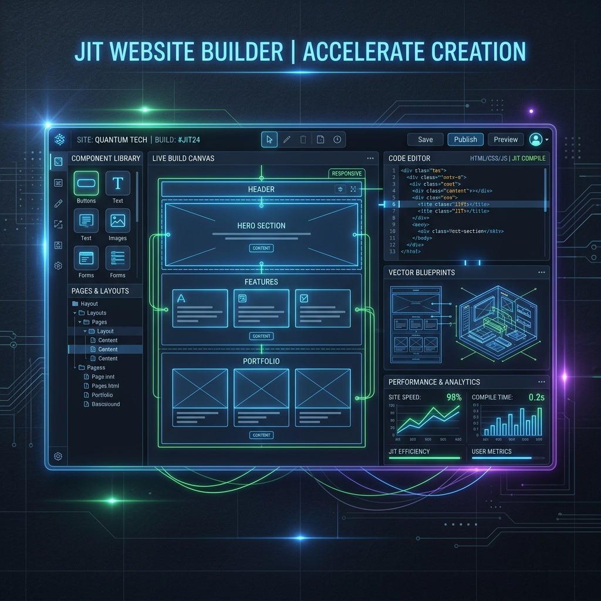

#  InstantSite AI — Generate Premium Websites in Seconds

> A next-generation AI website generator translating text prompts and design reference documents into responsive web interfaces with a live visual editor, Monaco code workspace, and JIT style compilation.

[](https://instant-site-ai.vercel.app/)
[](LICENSE)
[](https://github.com/sabledattatray/InstantSite-AI)

---



---

## 🌍 The Paradigm
**InstantSite AI** shifts web design from manual coding to semantic expression. By leveraging state-of-the-art Generative Large Language Models combined with a local Just-In-Time (JIT) CSS compilation pipeline, developers can describe web structures or attach wireframe screenshots and receive high-fidelity, interactive, and responsive web pages in real-time.

### 🌟 Key Capabilities
- **Prompt-to-Site Compilation**: Auto-transpilation of natural language prompts into production-grade HTML layouts with Tailwind class tokens.
- **Multimodal Design Matcher**: Upload reference mockups or supply target design URLs (`e.g., https://stripe.com`) to extract brand color schemes, styling cues, and fonts automatically.
- **Live Monaco Code Workspace**: Integrated Monaco Editor side-by-side with a reactive iframe viewer for instant live code overrides.
- **Interactive Sandbox Simulator**: Pre-built dashboard wireframes (SaaS Analytics, Portfolio, E-commerce) load instantly to let users experiment with layout themes before spawning fresh projects.
- **Git Integration Workspace**: Simulate commits and push direct builds to GitHub repositories.

---

## 🛠️ Architecture & Dataflow

InstantSite AI combines structural generation with a real-time hot-reloading iframe loop:

```
[ Natural Language Prompt / Mockup Image / Reference URL ]
                           │
                           ▼
              ┌────────────────────────┐
              │   AI Generation Node   │ <── Contextual parameters (Style presets, Brand colors)
              └────────────────────────┘
                           │
                           ▼
          ┌────────────────────────────────┐
          │   Tailwind JIT Class Parser    │
          └────────────────────────────────┘
                           │
                           ▼
              ┌────────────────────────┐
              │ Live Monaco Workspace  │ <── Bidirectional code changes
              └────────────────────────┘
                           │
                           ▼
      ┌────────────────────────────────────────┐
      │   Responsive Iframe Preview Canvas     │
      └────────────────────────────────────────┘
          /                │                 \
         ▼                 ▼                  ▼
 [ Local ZIP Export ]   [ Git Push ]   [ Instant Webhook Deploy ]
```

---

## 🚀 Live Demo & Sandbox

Access the live cloud deployment here:
👉 **[instant-site-ai.vercel.app](https://instant-site-ai.vercel.app/)**

---

## 🧱 Technical Stack

- **Frontend Core**: React 18, Vite, TypeScript, Tailwind CSS
- **Code Workspace**: Monaco Editor (`@monaco-editor/react`)
- **Backend API**: Node.js, Express, tsx engine, Supabase PG
- **AI Core**: Google Gemini 2.5 LLM (`@google/genai` Multimodal content pipelines)
- **Asset Compiler**: JSZip (binary packaging for offline templates)
- **Theme Engine**: Custom Tailwind CSS CSS variables, matching dark/light presets dynamically

---

## 📦 Installation & Setup

Set up your development workspace in less than two minutes:

### Prerequisites
- Node.js (v18 or higher)
- A Gemini API Key from [Google AI Studio](https://aistudio.google.com/)

### Step-by-Step Installation

1. **Clone the Repository**
   ```bash
   git clone https://github.com/sabledattatray/InstantSite-AI.git
   cd InstantSite-AI
   ```

2. **Configure Environment Variables**
   Create a `.env` file in the root directory:
   ```env
   GEMINI_API_KEY=your_gemini_api_key_here
   ```

3. **Install Dependencies**
   ```bash
   npm install
   ```

4. **Launch Local Server**
   Start the backend service and frontend compiler:
   ```bash
   npm run dev
   ```
   Open **[http://localhost:3005](http://localhost:3005)** in your web browser.

---

## 📁 Repository Structure

```text
InstantSite-AI/
├── public/                 # Static SEO & layout assets
│   ├── favicon.svg         # Premium gradient brand icon
│   ├── robots.txt          # Crawler directives
│   ├── sitemap.xml         # XML path indexing
│   └── social_preview.png  # High-fidelity social preview thumbnail
├── src/
│   ├── components/         # LivePreview components
│   ├── types.ts            # Layout type models
│   ├── App.tsx             # Main router and landing page logic
│   └── index.css           # Global custom style presets & utility classes
├── server.ts               # Backend express server with API routing
├── vercel.json             # SPA routing rewrite rules
└── package.json            # Scripts & project dependencies
```

---

## 🎯 Sample Prompts to Try

Copy these prompts into the AI Prompt input field:

- 📊 **SaaS Dashboard**: `"Modern SaaS CRM analytics panel with real-time conversion widgets, glassmorphism sidebar, and glowing dark purple theme."`
- 🎨 **Creator Portfolio**: `"Ultra premium photographer portfolio with a full-width landing slider, clean typography, and neon accent filters."`
- ⌨️ **Custom Store**: `"Dark cyberpunk keyboard store layout featuring product cards, filtering widgets, and responsive checkouts."`

---

## 🌟 Roadmap

- [ ] **Multi-Page Generative Trees**: Compile multiple interlinked subpages simultaneously.
- [ ] **Tailwind-to-React Converter**: Generate TypeScript-compliant React component exports with standard imports.
- [ ] **Dynamic Vector Generation**: Dynamic placeholder SVG creation for logo variants on demand.
- [ ] **Full White-Labeling**: Custom domain mapper with SSL termination via Vercel Edge integration.

---

## 🤝 Contributing

Contributions are welcome! Please follow these guidelines:
1. Fork the project.
2. Create your feature branch (`git checkout -b feature/AmazingFeature`).
3. Commit your changes (`git commit -m 'feat: Add AmazingFeature'`).
4. Push to the branch (`git push origin feature/AmazingFeature`).
5. Open a Pull Request.

---

## 📜 License

Distributed under the MIT License. See [LICENSE](LICENSE) for details.

---

## 💡 Author

Built with ❤️ by **Datta Sable**

- **Personal Website**: [dattasable.com](https://dattasable.com)
- **LinkedIn**: [linkedin.com/in/dattasable](https://linkedin.com/in/dattasable)
- **GitHub**: [github.com/dattasable](https://github.com/dattasable)

---
*⭐ If you find this project helpful, please consider giving it a star on GitHub! ⭐*
